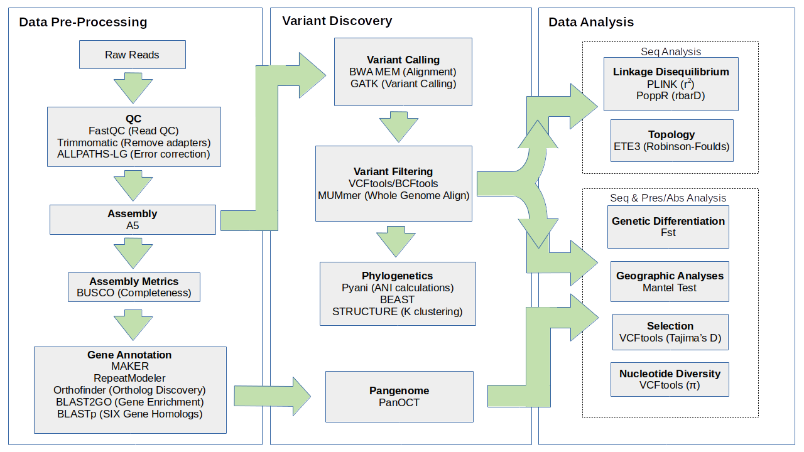
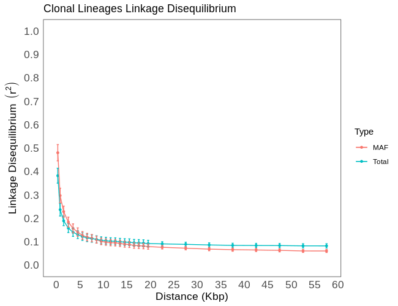
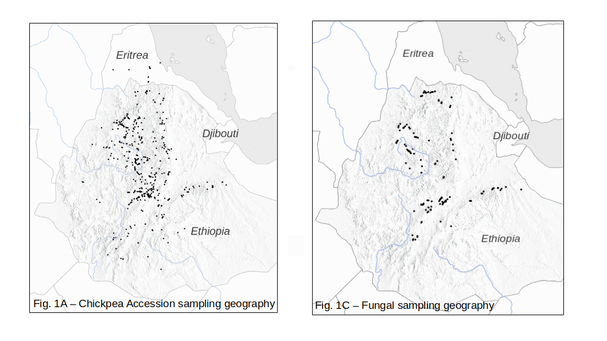
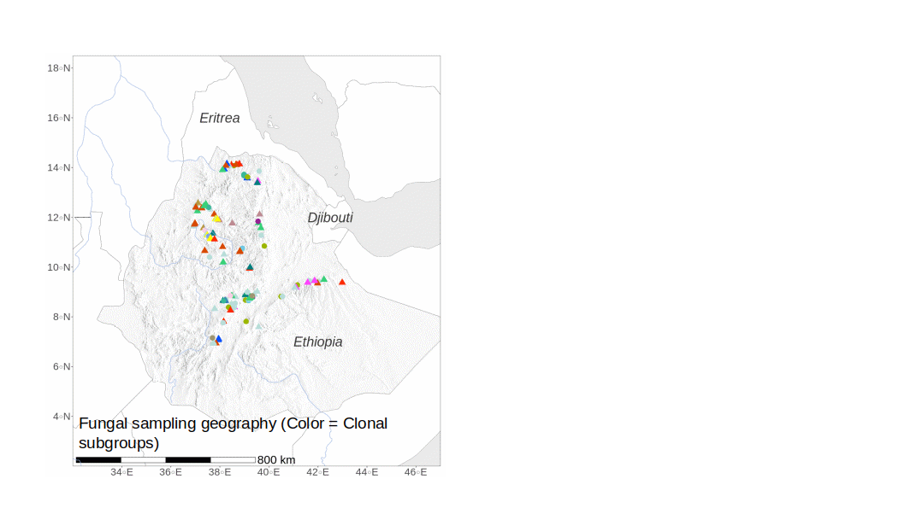
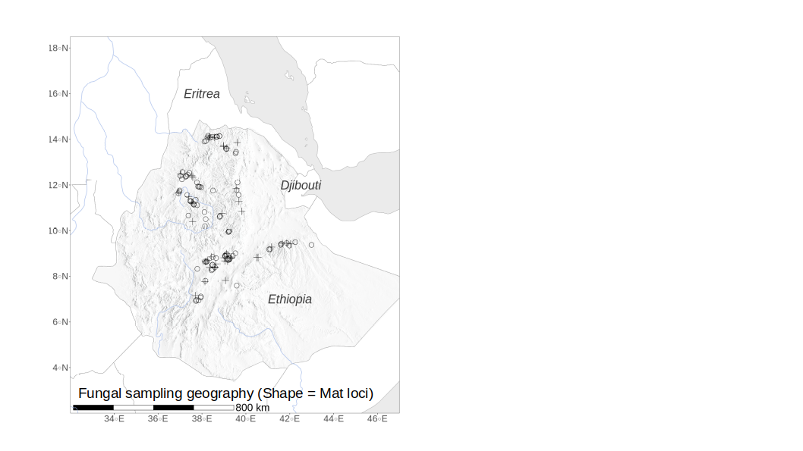
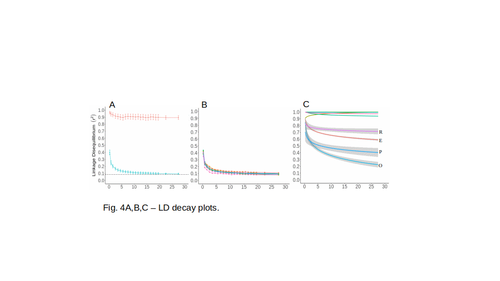
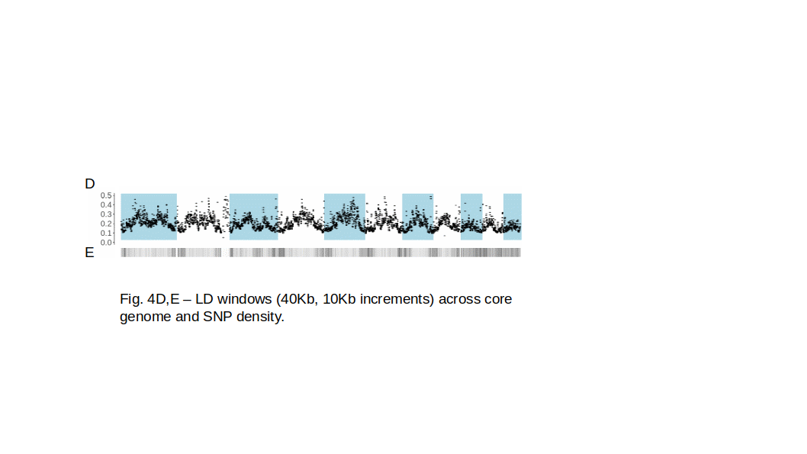
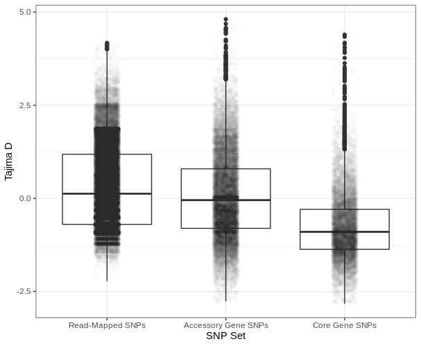

```{r setup, include=FALSE}
knitr::opts_chunk$set(echo = TRUE)
#library(reticulate)
```

---

## Contents

### 1. [Overview](#Overview)
### 2. [Genome Assembly](#assembly)
### 3. [Gene Annotation and Analyses](#gene_annotation)
### 4. [Identification of SNP and Genetic Groups](#read_mapping)
### 5. [Population Analyses](#pop_gen)
### 6. [References](#refs)

---

# <a id="Overview"></a>1. Overview



---

# <a id="assembly"></a>2. Genome Assembly

Tools required:

- FastQC v0.11.9 (https://github.com/s-andrews/FastQC)

- Trimmomatic v0.36 (Bolger et al, 2014)

- ALLPATHS-LG v52488 (Gnerre et al, 2010)

- A5 (Tritt et al, 2012)

- Hifiasm v16.0 (Cheng et al, 2021)

- Singularity v3.5.2

- FCG-GX (https://github.com/ncbi/fcs)

- BUSCO v3 (Simao et al, 2015)

### A. Quality check with FastQC

FastQC was used for the initial sequencing QC report.

```{bash, eval=F}
module load fastqc
fastqc $IN.fastq.gz
```

### B. Low quality reads and adapters trimmed using Trimmomatic v36

Reads that were lower than an average phred score < 33 were removed.

All adapter sequences contained within Illumina's adaptor database were removed.

```{bash, eval=F}
mkdir results/trimmomatic/"$SAMPLE"

java -jar bin/Trimmomatic-0.36/trimmomatic-0.36.jar PE -phred33 \
data/atsede-redo-libs/"$SAMPLE"_L006_R1_001.fastq.gz \
data/atsede-redo-libs/"$SAMPLE"_L006_R2_001.fastq.gz \
results/trimmomatic/"$SAMPLE"/"$SAMPLE".R1.paired.fastq.gz \
results/trimmomatic/"$SAMPLE"/"$SAMPLE".R1.unpaired.fastq.gz \
results/trimmomatic/"$SAMPLE"/"$SAMPLE".R2.paired.fastq.gz \
results/trimmomatic/"$SAMPLE"/"$SAMPLE".R2.unpaired.fastq.gz \
ILLUMINACLIP:bin/Trimmomatic-0.36/adapters/NexteraPE-PE.fa:2:30:10 LEADING:3 TRAILING:3 SLIDINGWINDOW:4:15 MINLEN:36

```

### C. Error correction using ALLPATHS-LG

To remove erroneous mutations during sequencing, ALLPATHS-LG was used to error correct reads.

```{bash, eval=F}
#ALLPATHS-LG was run with default parameters
#e.g.
ErrorCorrectReads.pl read_p1.fastq.gz read_p2.fastq.gz PHRED_ENCODING=33 READS_OUT=$OUT
```

### D. Assembly using A5

Assembly of all Illumina genomes was conducted with default parameters.

```{bash, eval=F}
#A5 was run with default parameters
#e.g.
a5_pipeline.pl read_p1.fastq.gz read_p2.fastq.gz mygenome
```

### E. Assembly using Hifiasm (PacBio)

Assembly of Fo-Et-0028 PacBio genome

```{bash, eval=F}
module load hifiasm
source activate hifiasm-0.16.1
hifiasm -o fo_et_0028_pacbio.asm --primary -t 32 demultiplex.bc1001--bc1001.hifi_reads.fastq.gz
conda deactivate
```


### F. Contaminant identification using FCS-GX

To identify and remove contaminants from assemblies, we used NCBI's FCS-GX (available at https://github.com/ncbi/fcs)
This program screens for contaminants by identifying contigs/scaffolds that do not originate from the biological source organism (as defined by Refseq)

```{bash, eval=F}
#load singularity
module load singularity
module load python3/3.7.4

#gathering fcs-gx singularity image
curl -LO https://github.com/ncbi/fcs/raw/main/dist/run_fcsgx.py
curl -LO https://github.com/ncbi/fcs/raw/main/examples/fcsgx_test.fa.gz
curl https://ftp.ncbi.nlm.nih.gov/genomes/TOOLS/FCS/releases/0.3.0/fcs-gx.0.3.0.sif -Lo fcsgx.sif

#create temporary shared memory
SHM_LOC=/home/melland/cook/long_read/PB852_4plex_Fusarium_HiFiv3/r64069_20230119_233108/A1/DemuxBarcodes/outputs/assemblies_hifiasm/contaminant_removal
mkdir -p "${SHM_LOC}/gxdb"
mkdir -p ./gxdb
mkdir -p ./gx_out

#verify functionality using small test-only database
#python3 ./run_fcsgx.py --fasta ./fcsgx_test.fa.gz --out-dir ./gx_out/ --gx-db "${SHM_LOC}/gxdb/test-only" --gx-db-disk ./gxdb --split-fasta --tax-id 6973 --container-engine=singularity --image=fcsgx.sif

#do full contamination analysis
#uses manifest file containing list of all fasta files paths
python3 ./run_fcsgx.py --fasta ./manifest_fo.mft --out-dir ./gx_out/ --gx-db "${SHM_LOC}/gxdb/all" --split-fasta --tax-id 5507 --container-engine=singularity --image=fcsgx.sif

# all contaminant contigs/scaffolds were removed unless they contained a bonafide Fusarium oxysporum gene (>95% identity)
```


### G. Genome completeness assessed using BUSCO v3 (Sordariomyceta odb9 dataset)

The completeness of each genome was assessed using BUSCO. This was used as a filtering step for the pangenome construction, as only genomes with greater than 98% BUSCO complete. The Sordariomyceta ODB9 database was used to specify the lineage and the Fusarium graminearum was used for the gene finding parameters (Fusarium oxysporum is not available).

```{bash, eval=F}
## parameters to use for running BUSCO
docker run -it --rm -v $(pwd):/home/working -w /home/working chrishah/busco-docker run_BUSCO.py --in ./Fusarium_oxysporum.fasta --out Fusarium-BUSCO -l ./sordariomyceta_odb9 --mode genome --sp fusarium_graminearum --c 20
```

---

# <a id="gene_annotation"></a>3. Gene Annotation and Analyses

Tools required:

- Pyani v0.2.9 (Pritchard et al, 2016)

- RepeatModeler v1.0.11 (http://www.repeatmasker.org)

- MAKER v2.31 (Cantarel et al, 2008)

- Interproscan v5.46 (Jones et al, 2014)

- BLASTp v2.7.1

- AHRD v2.0 (https://github.com/groupschoof/AHRD)

- BLAST2GO GUI (https://www.blast2go.com/)

- Orthofinder v2.5.4 (Emms and Kelly, 2019)

### A. Average nucleotide identity calculated with Pyani

```{bash, eval=F}
/home/afayyaz/bin/singularity run /home/afayyaz/singularityImages/average_nucleotide_identity-v0.2.9.simg -i all-genomes/ -g -m ANIb --workers 20 -o pyani-results
```


### B. Gene Annotation

#### i. The general gene annotation was done By using MAKER, RepeatModeler, Interproscan, BlastP and AHRD

RepeatModeler: We generated the library for custom repeats using RepeatModeler and used these custom library of repeats to feed into MAKER.

```{bash, eval=F}
## to generate library for custom repeats using RepeatModeler

 $:/home/localhost/adf/sw/bin/singularity shell /erdos/adf/sw/singularityImages/repeatmodeler-1.0.11--pl5.22.0_0.img

./dfam-tetools.sh --singularity --container=dfam/tetools:latest --trf_prgm=/erdos/adf/sw/trf409.linux64 -- BuildDatabase -name fusariumdatabase -engine ncbi Fo-Et-0090.fasta
./dfam-tetools.sh --singularity --container=dfam/tetools:latest --trf_prgm=/erdos/adf/sw/trf409.linux64 -- RepeatModeler -database fusariumdatabase -LTRStruct -pa 20 >& repeats.out

```{bash, eval=F}
##structural annotation using MAKER

i=`ls *.fasta`
for j in $i; do  maker -g $j 2>&1 | tee round1_$j.log ; done
mkdir snap
cd snap
maker2zff -n ../Fo-Et-0090.all.gff
fathom genome.ann genome.dna -categorize 1000
fathom uni.ann uni.dna -export 1000 -plus
forge export.ann export.dna
hmm-assembler.pl Fo-Et-0090 . > Fo-Et-0090.hmm
##used this hmm file to train next round of MAKER for all of the genome
for j in $i; do  maker -g $j 2>&1 | tee round1_$j.log ; done

##functional annotation using iprscan, blastp and AHRD for example using one genome "Fo-Et-0000"

handle_stop_codons.pl --stop_char '\*' Fo-Et-0000.all.maker.proteins.fasta > Fo-Et-0000.all.maker.proteins-stop-remove.fasta
mkdir chunks
fasta2chunks.pl --chunksize=1000 --chunk_prefix=chunks/chunk Fo-Et-0000.all.maker.proteins-stop-remove.fasta
IPRSCAN_HELPERS=/home/afayyaz/chado_preprocessing
JOB_LIMIT=32
export ANALYSIS_DATA_ROOT=`pwd`
mkdir iprscan; pushd iprscan
if [[ `which qsub` != "" ]]; then
for f in ../chunks/*; do echo ${IPRSCAN_HELPERS}/run_iprscan.bash $f | qsub -cwd -pe smp 8; done
else
for f in ../chunks/*; do
while (( `jobs | wc -l` >= $JOB_LIMIT )); do sleep 5; done;
${IPRSCAN_HELPERS}/run_iprscan.bash $f &
done
fi
#then to get iprscan "raw" output for AHRD
${IPRSCAN_HELPERS}/iprscan_convert.bash
mkdir ../iprscan_raw
mv *raw ../iprscan_raw
cd ../
mkdir ipr2go
for f in iprscan_raw/*; do ${IPRSCAN_HELPERS}/ipr2go.pl $f > `echo $f | sed 's/^iprscan_raw/ipr2go/'`; done
forkjobs_blastp_ahrd.pl --forks $JOB_LIMIT chunks blastp

perl -i ahrd_untruncate_blast_query_ids.pl blastp/fol/*
perl -i ahrd_untruncate_blast_query_ids.pl blastp/yeast/*
perl -i ahrd_untruncate_blast_query_ids.pl blastp/gram/*
perl -i ahrd_untruncate_blast_query_ids.pl blastp/vene/*
perl -i ahrd_untruncate_blast_query_ids.pl blastp/poae/*
mkdir AHRD
perl -p -e 's/\$\{([^}]+)\}/defined $ENV{$1} ? $ENV{$1} : $&/eg' /home/afayyaz/batcher_input_example_template.yml > AHRD/batcher_input_example.yml
ln -s ${INTERPRO_DB_ROOT}/interpro.dtd AHRD/interpro.dtd
pushd AHRD
mkdir batch_yml
java -cp ${AHRD_GIT_ROOT}/bin/ahrd.jar ahrd.controller.Batcher batcher_input_example.yml
perl -pi -e 's/$/ &/;' batcher.bash
source batcher.bash
for f in *csv; do if [[ ! -s all.ahrd.tsv ]]; then grep '^Protein-Accession' $f > all.ahrd.tsv; fi; sed -n '4,$p' $f >> all.ahrd.tsv; done
${IPRSCAN_HELPERS}/clean_AHRD.sh all.ahrd.tsv | sed 's/-mRNA-1//' > all.ahrd.tsv.cleaned
popd
cat iprscan_raw/* > all.iprscan_raw
awk 'BEGIN {FS="\t"} NF==9 && $2 == "maker" {print}' Fo-Et-0000.all.gff > Fo-Et-0000.all.maker.gff
##We added the annotation into gff files
singularity exec --bind `pwd`:/pwd --pwd /pwd /erdos/adf/sw/singularityImages/maker-2.31.9--3.img ipr_update_gff Fo-Et-0000.all.maker.gff all.iprscan_raw > Fo-Et-0000.all.gff.iprscan_updated
${IPRSCAN_HELPERS}/add_note_attr_inGFF.pl AHRD/all.ahrd.tsv.cleaned Fo-Et-0000.all.gff.iprscan_updated > Fo-Et-0000.all.gff.iprscan_updated+AHRD
##We generated the gene id's and replace it with existing gene identifiers in the fasta and gff files.
singularity exec --bind `pwd`:/pwd --pwd /pwd /erdos/adf/sw/singularityImages/maker-2.31.9--3.img maker_map_ids --prefix FO0000- Fo-Et-0000.all.gff > map
singularity exec --bind `pwd`:/pwd --pwd /pwd /erdos/adf/sw/singularityImages/maker-2.31.9--3.img map_gff_ids map Fo-Et-0000.all.gff
singularity exec --bind `pwd`:/pwd --pwd /pwd /erdos/adf/sw/singularityImages/maker-2.31.9--3.img map_fasta_ids map Fo-Et-0000.all.maker.proteins.fasta 
singularity exec --bind `pwd`:/pwd --pwd /pwd /erdos/adf/sw/singularityImages/maker-2.31.9--3.img map_fasta_ids map Fo-Et-0000.all.maker.transcripts.fasta
singularity exec --bind `pwd`:/pwd --pwd /pwd /erdos/adf/sw/singularityImages/maker-2.31.9--3.img map_gff_ids map Fo-Et-0000.all.gff.iprscan_updated+AHRD
singularity exec --bind `pwd`:/pwd --pwd /pwd /erdos/adf/sw/singularityImages/maker-2.31.9--3.img map_data_ids map AHRD/all.ahrd.tsv.cleaned
cut -d'|' -f1,1 Fo-Et-0000.all.maker.proteins.fasta | sed 's!-RA!!g' >> Fo-Et-0000.all.maker.proteins.final.fasta
cut -d'|' -f1,1 Fo-Et-0000.all.maker.transcripts.fasta | sed 's!-RA!!g' >> Fo-Et-0000.all.maker.transcripts.final.fasta
/home/localhost/adf/ahrdify_fasta.pl AHRD/all.ahrd.tsv.cleaned Fo-Et-0000.all.maker.proteins.fasta Fo-Et-0000.all.maker.transcripts.fasta
##Repeated the same for rest of the genome
```
  
#### ii. Gene Enrichment analysus was performed using BLAST2GO
  
Implemented using GUI software (https://www.blast2go.com/)
  
#### iii. SIX genes homologs were identified using BLASTp

We used an E-value cutoff of 1E-6 to ensure that they were true homologs

#### iv. Orthologs were identified with Orthofinder

```{bash, eval=F}
 singularity exec /home/afayyaz/singularity-images/orthofinder_2.5.4.sif orthofinder -t 50 -a 10 -f /home/afayyaz/99-isolate-orth-run/ > ortho_log_file 2>&1 
```
  
### C. Phylogenetic Analyses

Tools Required:

- BEAST v1.10.4 (Suchard et al, 2018)

- ETE3 Toolkit (Huerta-Cepas et al, 2016)

To understand the evolutionary history of the Ethiopian collection, the species phylogenies were constructed using BEAST. The phylogenies were built from concatenated BUSCO gene alignments.

```{bash, eval=F}
##Firstly, We extracted the single copy gene names/list form BUSCO results
perl busco_find_conserved_single_copy_across_all.pl run_*/full_table* > busco_find_conserved_single_copy_across_all.txt
##then we extracted the fasta sequences from the genoem files
for i in `cat busco_find_conserved_single_copy_across_all.txt`; do grep -A1 $i all-busco-single-copy-genes.fna --no-group-separator >> $i.fna; done
##We used clustalo for alignment of the 1556 genes
/home/afayyaz/bin/clustalo -i genes.fna -o genes-aligned.fasta --outfmt=fasta --threads 40
##then we used the aligned file, convert it into nexus file by using seqmagick(python package) and concatenate all of the nexus file into one file for beauti software 
python3.8 seqmagick.py convert --output-format nexus --alphabet dna /home/afayyaz/aligned-genes-fasta/EOG***.fna /home/afayyaz/edit-genes/EOG***.nex
python3.8 cat-nex.py
##generated the xml file in beauti and used in Beast 
java -jar /home/afayyaz/bin/BEASTv1.10.4/lib/beast.jar -threads 20 gene_alignment.xml

##used standard parameters for all of the phylogenetic trees and visulaized in iTOL
```
  
Robinson-Foulds (RF) is a metric that measures the distance between different phylogenetic trees. To check the congruence between different trees, we used the normalized Robinson-Foulds (nRF) with ETE3 toolkit. For phylogenetic trees that are highly congruent, the expectation under highly clonal populations, the nRF value would be close to 0, whereas highly incongruent phylogenetic trees would be closer to 1. 

SNPs were called from the concatenated BUSCO alignments and filtered to remove any SNP sites with missing data. Because allele frequency could potentially play a role in the nRF calculations, each SNP site was binned based on allele frequency and normalized accordingly. The nRF was calculated by subsampling these SNPs randomly 10 times with each containing 356,463 SNPs (all SNPs) and 601,905 (ancestral SNPs only)

```{bash, eval=F}

##We called SNP's on 1556 BUSCO single copy genes using snp-sites(https://github.com/sanger-pathogens/snp-sites)
for i in `ls *.fasta`; do snp-sites -rmv -o $i $i; done

##We removed all entries with missing data
cat *fasta.vcf > all_genes.fasta.vcf 
$awk '$0 !~ "_" {print}' all_genes.fasta.vcf > all_gene_snp_nomissing.vcf 
cat all_gene_snp_nomissing.vcf | awk -v OFS="\t" '$0 !~ "^#" {hom_REF = 0; hom_ALT = 0; ; hom_var_2 = 0; hom_var_3 = 0; het = 0; for(i=10;i<=NF;i++) { if($i ~ /0/) hom_REF++; else if($i ~ /1/) hom_ALT++; else if($i ~ /2/) hom_var_2++;else if($i ~ /3/) hom_var_3++; else het++; } print $1, $2,$3, $4, $5, hom_REF, hom_ALT, hom_var_2, hom_var_3, het}' >> maf-column.txt
paste all_gene_snp_nomissing.vcf maf-column.txt > all_gene_snp-maf-file.vcf

```

```{r, eval=F}
##R code for selecting SNP's
library(dplyr)
file <- read.delim("all_gene_snp-maf-file.vcf.txt")
mydata <- data.frame(file)
data <- arrange(mydata, desc(maf))
subset1 <- subset(data, maf < 0.1 )
subset2 <- subset(data, maf >= 0.1 & maf < 0.2)
subset3 <- subset(data, maf >= 0.2 & maf < 0.3)
subset4 <- subset(data, maf >= 0.3 & maf < 0.4)
subset5 <- subset(data, maf > 0.4)
###Total number of SNP's are 706149
###No of SNP's in subset1 -> 299273
###No of SNP's in subset2 -> 402709
###No of SNP's in subset3 -> 2103
###No of SNP's in subset4 -> 1052
###No of SNP's in subset5 -> 1012
##We randomly selected snps from subsets based on the percentage representation in the total amount

x <- slice_sample(subset1, n=126831)
y <- slice_sample(subset2, n=229624) 
z <- slice_sample(subset3, n=6)
a <- slice_sample(subset4, n=1)
b <- slice_sample(subset5, n=1)

#randomly selecting snps from subsets based on the percentage representation in the total amount
write.table(x, file = "x-export-file.txt", sep = "\t" )
write.table(y, file = "y-export-file.txt", sep = "\t" )
write.table(z, file = "z-export-file.txt", sep = "\t" )
write.table(a, file = "a-export-file.txt", sep = "\t" )
write.table(b, file = "b-export-file.txt", sep = "\t" )
#concatente in bash and add header of the original vcf file.
```

```{bash, eval=F}
#To filter for ancestral SNP's on a per clade basis
for F in *.vcf.gz; do bgzip -dc $F | //
awk '{for(i=11;i<=NF;i++)if($i!=$(i-1)&&$1!~/#/)next}1' | //
bgzip -c > ${F}_filtered.vcf.gz; done 

#The filtered VCF files for all clades were then combined to calculate the ancestral SNP Robinson-Foulds values

###Total number of SNP's are 613071
###No of SNP's in subset1 -> 607962
###No of SNP's in subset2 -> 3486
###No of SNP's in subset3 -> 795
###No of SNP's in subset4 -> 455
###No of SNP's in subset5 -> 329
```

```{r, eval=F}
x <- slice_sample(subset1, n=601882)
y <- slice_sample(subset2, n=20) 
z <- slice_sample(subset3, n=1)
a <- slice_sample(subset4, n=1)
b <- slice_sample(subset5, n=1)
write.table(x, file = "x-export-file.txt", sep = "\t" )
write.table(y, file = "y-export-file.txt", sep = "\t" )
write.table(z, file = "z-export-file.txt", sep = "\t" )
write.table(a, file = "a-export-file.txt", sep = "\t" )
write.table(b, file = "b-export-file.txt", sep = "\t" )
```

```{bash, eval=F}
#concatente in bash and add header of the original vcf file.

##converted vcf format to fasta format and used 
cat subset.vcf | perl vcf_to_fasta.pl > vcftofasta.fasta
##generated the xml file in beauti and used in Beast 
java -jar /home/afayyaz/bin/BEASTv1.10.4/lib/beast.jar -threads 20 gene_alignment.xml
##generated 10 different trees newick files labeld as "1.txt 2.txt 3.txt 4.txt 5.txt 6.txt 7.txt 8.txt 9.txt 10.txt"
ete3 compare -taboutput -t 1.txt 2.txt 3.txt 4.txt 5.txt 6.txt 7.txt 8.txt 9.txt 10.txt -r 1.txt 2.txt 3.txt 4.txt 5.txt 6.txt 7.txt 8.txt 9.txt 10.txt > result.txt
```
  
### D. <a id="pangenome"></a>Pangenome

Tools required:

- PanOCT v3.23 (Fouts et al, 2012)

- VCFtools v0.1.15 (Danecek et al, 2011)

Pangenome was constructed using PanOCT software. Genes predicted by MAKER were clustered together if the percentage identity was >80% and the genes were genomically syntenic.

```{bash, eval=F}
singularity exec /home/afayyaz/singularity-images/panoct_3.23--pl526_1.sif panoct.pl -t blast-results.txt -g final-e-attribute.txt -P 99-all-protein.pep -f list-e.txt -b /home/afayyaz/group-e-panoct/ -i 95 -L 20 -M Y -F 1.33 -N Y -H Y -V Y -S Y -C Y -B Y -c 0,5,25,50,75,90,95,98,100 > panoct-test 2>&1
```
  
Before we calculated the nucleotide diversity for the pangenome, we removed the paralogs from the gene presence absence file
 
```{bash, eval=F}
###Removed paralogs from panoct result file
Python3 script-paralogs.py
###To calculate nucleotide diversity for pan-genome, we needed the files of each cluster in the pangenome containing number of genomes from 5 to 99
awk -F"\t" '{print >> ($101".txt")}' without-paralogs.txt  
###Then we made a list of the cluster in the pangenome
for i in `ls cluster*`; do sed $'s/\t/\\\n/g' $i| sed '/^$/d' | sed '$d' | sed '$d' > $i.txt; done
###We extracted the cluster sequence from each genome
for i in `ls cluster*.txt`; do python3 extract_seq.py final-99-isolate-transcript.fasta $i $i.fasta; done
###We aligned the sequence using mafft
for i in `ls *.fasta`; do mafft --thread 20 $i > $i.aligned.fasta; done
###We called SNP's using python package snp-sites(https://github.com/sanger-pathogens/snp-sites)
for i in `ls *.fasta`; do snp-sites -rmv -o $i $i; done
for i in `ls *.vcf`; do sed 's/*/_/g' $i | awk '$0 !~ "_" {print}' | awk '{for(i=1;i<=NF;i++){if($i==0){$i="0/0"}}}{$1=$1} 1' OFS="\t" | awk '{for(i=10;i<=NF;i++){if($i==1){$i="1/1"}}}{$1=$1} 1' OFS="\t"| awk '{for(i=10;i<=NF;i++){if($i==2){$i="2/2"}}}{$1=$1} 1' OFS="\t" > $i-p.vcf; done
###We calculated nucleotide diversity using vcftools
for i in `ls *-p.vcf`; do vcftools --vcf $i --site-pi --out $i-nucl_diversity; done
for i in `ls *.pi`; do sed '1d' $i > $i.txt ; done
##We took the average of each file
ls *.txt > file_list
while read line; do awk '{sum+=$2} END {print sum/NR}' $line >> avg-pi-file; done<list-avg-pi.txt
mv file_new avg-values
cp *-aligned-files/avg* .
for i in `ls avg-*`; do awk '{print FILENAME (NF?"\t":"") $0}' $i > $i.txt; done
cat *.txt > all-cluster-pi.txt
###We calculated tajimas-d using vcftools
for i in `ls *-p.vcf`; do vcftools --vcf $i --TajimaD 100000000 --out $i-tajimad.txt; done
for i in `ls *.Tajima.D.txt`; do sed '1d' $i> $i.txt; done
##We took the average of each file
while read line; do awk '{sum+=$5} END {print sum/NR}' $line >> avg-tajima-file; done<list-avg-tajima.txt
mv file_new avg-values
cp *-aligned-files/avg* .
for i in `ls avg-*`; do awk '{print FILENAME (NF?"\t":"") $0}' $i > $i.txt; done
cat *.D.txt > tajima.d.txt
##repeat these steps for all clusters containing number of genomes from 5 to 99
```
  
---

# <a id="read_mapping"></a>4. Identification of SNP and genetic groups

### A. Read mapping and Variant calling

Tools required:

- BWA MEM v0.7.9a-r786 (Li, 2013)

- SAMtools v1.3.1 (Li et al, 2009)

- VCFtools v0.1.15 (Danecek et al, 2011)

- BCFtools v1.16 (Danecek et al, 2021)

- Picard (http://broadinstitute.github.io/picard/)

- GATK v4.1 (McKenna et al, 2010)

```{bash, eval=F}
#create index for F. oxysporum reference genome (Fol4287 - GCF_000149955.1)
bwa index [-a bwtsw|is] reference.fasta index_prefix
samtools faidx reference.fasta
##created sequence dictionary
java -jar /home/afayyaz/software/picard/build/libs/picard-2.25.7-SNAPSHOT-all.jar CreateSequenceDictionary REFERENCE=reference.fasta OUTPUT=reference.dict
##lign reads and assign read group
for i in $(ls *.fastq.gz | cut -d '_' -f1,2,3| uniq); do bwa mem -t 60 -R "@RG\tID:${i}\tSM:${i}\tPL:illumina\tPU:Lane1\tLB:${i}" reference.fasta ${i}_R1_pair_001.fastq.gz ${i}_R2_pair_001.fastq.gz > ${i}.sam; done
##sorting sam files
for i in `ls *.sam`; do java -jar /home/afayyaz/software/picard/build/libs/picard-2.25.7-SNAPSHOT-all.jar SortSam I=$i O=$i.bam SORT_ORDER=coordinate; done
##mark duplicates
for i in `ls *.bam`; do java -jar /home/afayyaz/software/picard/build/libs/picard-2.25.7-SNAPSHOT-all.jar MarkDuplicates I=$i O=$i-edit.bam REMOVE_DUPLICATES=true METRICS_FILE=$i-metrics.txt; done
##sort bam file
for i in `ls *-edit.bam`; do java -jar /erdos/cook_lab/afayyaz/software/picard/build/libs/picard-2.25.7-SNAPSHOT-all.jar BuildBamIndex INPUT=$i ; done
##called variants
for i in `ls *-edit.bam`; do gatk HaplotypeCaller -R reference.fasta -I $i -ploidy 1 --native-pair-hmm-threads 40 -ERC GVCF -O $i-raw_gVCF.vcf --spark-runner LOCAL; done
for i in `ls *-raw_gVCF.vcf`; do gatk GenotypeGVCFs -O $i-raw.vcf -R reference.fasta --spark-runner LOCAL -V $i; done
for i in `ls *-raw.vcf`; do bgzip -c $i > $i.gz; done
for i in `ls *-raw.vcf.gz`; do tabix -p vcf $i ; done
bcftools merge *vcf.gz -o a-merged.vcf
##extract SNP's and stats
gatk SelectVariants -R reference.fasta -V a-merged.vcf -select-type SNP -O c-snps.vcf
bcftools stats c-snps.vcf > stats-snps.txt
vcftools --vcf c-snps.vcf --out c-filtered --minDP 10 --max-missing 0.95 --minQ 30 --recode --recode-INFO-all
```

### B. Filtering VCF file 

Tools required:

- BCFtools v1.16 (Danecek et al, 2021)

- VCFtools v0.1.15 (Danecek et al, 2011)

- MUMmer v3.23 (Marcais et al, 2018)

For most population analyses, we exclusively used high quality genomes (based on BUSCO completeness > 98%, N50 > 1,200 and genome size) - see "Genome Assembly". This provided a total list of 120 genomes, 99 of which were taxonomically within the FOSC (Fig. 2). This is reduced the total number of isolates (320) (Supplemental Fig. 1).

#### i. We split the VCF into separate single isolate VCF files

```{bash, eval=F}
######## ./splitting_vcfs_retaining.sh ###########

#!/usr/bin/env bash
for file in *.vcf.gz; do
  for sample in `bcftools query -l $file`; do
    bcftools view -Oz -s $sample -o ${file/.vcf*/.$sample.vcf.gz} $file
  done
done
```

#### ii. We indexed all the single isolate VCF files

```{bash, eval=F}
for f in *vcf.gz; do tabix -f -p vcf $f; done
```

#### iii. We merged isolates from list of high quality genomes (information obtained from assembly data)

```{bash, eval=F}
bcftools merge --file-list isolate_list > ethiopia_fo_structure.vcf
```

#### iv. We removed heterozygous/ambiguous SNPs using sed

```{bash, eval=F}
sed -i 's#0/1|0/2|0/3|0/4|1/2|1/3|1/4|2/3|2/4|3/4#[.]/[.]#g' ethiopia_fo_structure.vcf
```

#### v. We removed SNPs with high missingness and evaluated MAF filtering

To ensure that the subsequent VCF was high quality, especially for linkage disequilibrium, we adjusted filters to learn how different filters affect the subsequent linkage disequilibrium analyses. 

The main two parameters were missingness and minor allele frequency (MAF). MAF was of particular importance to us, as often researchers adjust MAF cutoff as >0.05 without regard for the effects on the population. 

```{bash, eval=F}
#VCF file for population genetic analyses
vcftools --vcf ethiopia_fo_structure.vcf --max-missing 0.9 --recode --stdout | bgzip -c > all_ethiopia_isolates.vcf.gz #total number of SNPs = 136772
```

This filtering step was evaluated to understand the effects of using MAF cutoffs (no MAF filter vs "typical" MAF >0.05). There were only minor differences in the outcomes. The clonal groupings remained the same. The LD decay curve only showed minor differences (see below)



#### vi. To ensure SNPs were core components of the genome, mapping was informed by additional whole genome alignments (MUMmer)

This was done on per chromosome basis (Fol4287 1-15)

```{bash, eval=F}
#Here is the example of chromosome 7 (Suppl. Fig. 2)
for f in Fo-Et-0*; do nucmer -maxmatch -c 100 -p ${f}_chr7 chr7.fna ${f}; done #outputs delta file

# Whole genome alignments were visualized and filtered in R
Rscript ./mummer_coverage.R

# This led to the removal of any SNPs mapped to chromosomes 3, 6, 14 and 15 as well as supercontig 27 (end of chromosome 1)
# Any reference contigs that mapped poorly to the Illumina genomes were removed running awk itieratively
# e.g. awk '($0 !~ "Supercontig_2.27"){print}' all_ethiopia_isolates.vcf.gz
```


### C. Identification of clonal groups using STRUCTURE

Tools required:

- STRUCTURE v2.3.4 (Pritchard et al, 2000)

- Structure Harvester (https://taylor0.biology.ucla.edu/structureHarvester/) (Earl et al, 2012)

- CLUMPP v1.1.2 (Jakobsson and Rosenberg, 2007)

Subdividing clonal lineages in fungal populations remains challenging. Traditionally, reasearchers have determined clonality based on identical MLGs. This approach fails on a whole genome scale due to the accumulation of erroneous mutations. We employed two different methods to subdivide the lineages: phylogenetics (see Gene Annotation and Analyses - BEAST) and K clustering (via STRUCTURE). 

#### i. <a id="struct"></a>Random subsampling SNPs

To avoid SNP selection bias, the VCF file was randomly subsampled at a rate of ~2.5%. 
Note that this script does not provide exactly 2.5% of the total number of SNPs (Table 1 - Non-clone corrected = 136,772), it gives each SNP a 2.5% chance of being included within the final subsampling.

```{bash, eval=F}

bgzip -dc all_ethiopia_isolates.vcf.gz | awk 'BEGIN {srand()} !/^$/ { if (rand() <= .025) print $0}' | bgzip -c > ethiopia_fo_structure.0_05.vcf.gz_sub1.vcf.gz

bgzip -dc all_ethiopia_isolates.vcf.gz | awk 'BEGIN {srand()} !/^$/ { if (rand() <= .025) print $0}' | bgzip -c > ethiopia_fo_structure.0_05.vcf.gz_sub2.vcf.gz

bgzip -dc all_ethiopia_isolates.vcf.gz | awk 'BEGIN {srand()} !/^$/ { if (rand() <= .025) print $0}' | bgzip -c > ethiopia_fo_structure.0_05.vcf.gz_sub3.vcf.gz

bgzip -dc all_ethiopia_isolates.vcf.gz | awk 'BEGIN {srand()} !/^$/ { if (rand() <= .025) print $0}' | bgzip -c > ethiopia_fo_structure.0_05.vcf.gz_sub4.vcf.gz

#etc.

#Subsample SNP Totals:
#Sub1 = 3658
#Sub2 = 3816
#Sub3 = 3642
#Sub4 = 3754
#Sub5 = 3769
#Sub6 = 3671
#Sub7 = 3737
#Sub8 = 3774
#Sub9 = 3745
#Sub10 =3744

```

VCF subsample files were converted into genotype files using a manual bash script

```{bash, eval=F}
############ ./convertvcftogeno.sh ############
#!/usr/bin/env bash
file=$1
out=${file}.out
bgzip -dc ${file} | awk '$1 ~ "Super" || $1 ~ "#CHROM" {print}' | awk '$1 !~ "##" {print}' | sed 's#0/0#0#g;s#1/1#1#g;s#2/2#2#g;s#3/3#3#g;s#4/4#4#g;s#0/1#-9#g;s#0/2#-9#g;s#0/3#-9#g;s#0/4#-9#g;s#1/2#-9#g;s#1/3#-9#g;s#1/4#-9#g;s#2/3#-9#g;s#2/4#-9#g;s#3/4#-9#g;s#./.#-9#g' | cut -f 2,10- | awk '
{ 
    for (i=1; i<=NF; i++)  {
        a[NR,i] = $i
    }
}
NF>p { p = NF }
END {    
    for(j=1; j<=p; j++) {
        str=a[1,j]
        for(i=2; i<=NR; i++){
            str=str" "a[i,j];
        }
        print str
    }
}' > $out
```

#### ii. STRUCTURE
  
Ran STRUCTURE on each subsampling 10 times: burnin = 10,000 and MCMC reps = 50,000. K values = 2-20.
  
```{bash, eval=F}
# e.g.
#!/bin/bash
module load structure-console/2.3.4
structure -K 10 -o structure_large10-1-2
```

#### iii. STRUCTUREharvester

Using outputs of STRUCTURE, combine them using STRUCTURE_HARVESTER (online web server: http://taylor0.biology.ucla.edu/structureHarvester/) to produce .indfiles for CLUMPP.

#### iv. CLUMPP

Ran CLUMPP on HPC cluster to collate 10 permutations of each subsample. Used LargeKGreedy algorithm.

```{bash, eval=F}
#e.g.
#!/bin/bash
module load CLUMPP/1.1.2
CLUMPP K2.paramfile -i K12.indfile -k 12 -c 133 -r 10 -m 3 -w 0 -s 2 -o K12.outfile -j K12.miscfile
```

#### v. STRUCTURE plotted with R script

```{bash, eval=F}
######### ./structure_plotting_larger_collection #############
```

#### vi. Clonal groups were assigned based on Euclidean distances

```{bash, eval=F}
######### ./plotting_structure_network.R ##########
./plotting_structure_network.R --list "list of all .outfile paths" --label "list of isolate names (in order)" --title "title of graph (usually K val included)"
```

---

# <a id="pop_gen"></a>5. Population Analyses

### A. Geographic Analyses

#### i. Plotting onto maps in R

To create plots of geographic sampling (both chickpea and Fungal sampling)

```{bash, eval=F}
######### ./geo_plot_ethiopia.R ###########
```


 



#### ii. Mantel tests

The Mantel test is a measure of correlation between two distance matrices. Here we want to understand how genetic difference (both sequence and presence/absence variation) is correlated with geography.
  
```{r, eval=F}
##We prepared the co-ordinates for all infected sample into data frame for mental test
library(ade4)
location = read.delim("location-for-distance-plot-99-isolates.txt")
rownames(location) <- location[, "Sample"]
location <- location[, -1]
x = as.matrix(location)
y <- distm(x, fun = distGeo)
physical_distance <- melt(y)

n <- max(table(physical_distance$Sample)) + 1  # +1,  so we have diagonal of 
res <- lapply(with(physical_distance, split(value, physical_distance$Sample)), function(x) c(rep(NA, n - length(x)), x))
res <- do.call("rbind", res)
res <- rbind(res, rep(NA, n))
res <- as.dist(t(res))
res
##mantel test for accessary genome usimg Jaccarad distance
m <- max(table(pan_distance$X)) + 1  # +1,  so we have diagonal of 
res2 <- lapply(with(pan_distance, split(value, pan_distance$X)), function(x) c(rep(NA, m - length(x)), x))
res2 <- do.call("rbind", res2)
res2 <- rbind(res2, rep(NA, m))
res2 <- as.dist(t(res2))
res2
mantel.rtest(res, res2, nrepet = 9999)
###manetl test for core using Conserved Ortholog genes were also performed the same.
```
  
  
### B. Linkage disequilibrium

We calculated linkage disequilibrium using two different methods:

1. Pearson's correlation coefficient (r2) [implemented in PLINK]
2. Index of association (rbarD) [implemented in PoppR]

#### i. Linkage Disequilibrium via r2

Tools required:

- Plink v1.90 (Purcell et al, 2007)

- BCFtools v1.16 (Danecek et al, 2021)

#### Preparing datasets for "clonally-derived" vs "ancestrally-derived" SNPs (Figure 4 and Table 1)

"Clonally-derived" SNPs are variants that are variable within clonal subgroups. 

"Ancestrally-derived" SNPs are variants that are fixed within clonal subgroups 

To do this, we separated the final VCF file (See Filtering VCF) into the subgroups defined by BEAST (phylogenetics) and STRUCTURE (K clustering).

1. Split the VCf file into groups

```{bash, eval=F}
######## ./splitting_vcfs_retaining.sh ###########

#!/usr/bin/env bash
for file in *.vcf.gz; do
  for sample in `bcftools query -l $file`; do
    bcftools view -Oz -s $sample -o ${file/.vcf*/.$sample.vcf.gz} $file
  done
done
```

2. Combine into VCF files on a clade basis using BCFtools

```{bash, eval=F}
#e.g. This is an example for clonal subgroup E. Note that this was done for all groups E-U
#note that "clade_e.txt" is a text file containing the list of isolates contained in subgroup E
bcftools merge -l clade_e.txt > clade_e.vcf.gz
```

3. Filtering step for clonally-derived SNPs
```{bash, eval=F}
bgzip -dc  $group.vcf.gz | // #input file lineages
awk '($0 ~ "1/1" && $0 ~ "0/0") || ($0 ~ "1/1" && $0 ~ "2/2") || //
($0 ~ "2/2" && $0 ~ "0/0") || ($0 ~ "3/3" && $0 ~ "0/0") || //
($0 ~ "4/4" && $0 ~ "0/0") || ($0 ~ "3/3" && $0 ~ "1/1") || //
($0 ~ "4/4" && $0 ~ "1/1") || ($0 ~ "3/3" && $0 ~ "2/2") || //
($0 ~ "4/4" && $0 ~ "2/2") || ($0 ~ "3/3" && $0 ~ "4/4") || //
$1 ~ /#/ {print $0}' | bgzip -c > $output.vcf.gz #output SNPs variable across each clonal group
#note that these files were used to generate Figure 4C (decay plot for each clonal lineage)

bcftools merge -l $(ls clade*) > var_clones.vcf.gz
```

4. Filtering step for ancestrally-derived SNPs

```{bash, eval=F}
#filter across clonal subgroup
for F in *.vcf.gz; do bgzip -dc $F | //
awk '{for(i=11;i<=NF;i++)if($i!=$(i-1)&&$1!~/#/)next}1' | //
bgzip -c > ${F}_filtered.vcf.gz; done #output SNPs fixed across entire clonal group

#choose one sequence from the subgroup VCF files
for F in *_filtered.vcf.gz; do bgzip -dc $F | //
cut -f 1-11 | //
bgzip -c > ${F}_represent.vcf.gz; done

#merge representative isolates
bcftools merge -l $(ls *_represent.vcf.gz) > eth_clonecorrected.vcf.gz
```

#### Linkage disequilibrium - r2

1. Run intra-chromosomal PLINK LD

```{bash, eval=F}
#code for clonally-derived SNPs
plink --vcf var_clones.vcf.gz --allow-extra-chr --r2 //
--ld-window-r2 0 --ld-window 99999 --out var_clone

#code for ancestrally-derived SNPs
plink --vcf total_clone.vcf.gz --allow-extra-chr --r2 --ld-window 99999 //
--ld-window-r2 0 --out total_clone

#note that PLINK automatically retains only biallelic SNPs

#calculating bp difference from PLINK LD output
for f in *.ld; do awk -F' ' '{print $1, $2, $5, $7, ($2-$5) }' $f | sed 's/-//g;s/ /\t/g' > diff_calculated/$f.diff; done

#filtering for bp difference <75000 (saves memory to permit R-based analysis)
for f in *diff; do awk '($5 < 75000) {print}' $f > rm_large_diffs/$f.75000.ld; done

#rest of plotting done in R
```

2. Run inter-chromosomal PLINK LD

Since inter-chromosomal SNPs can create unreasonably large file sizes (>100GB), we subset the SNP files before running

```{bash, eval=F}
#selects ~2.5% of the total SNPs (~2000-3000 SNPs)
#run on both var_clone.vcf.gz and eth_clonecorrected.vcf.gz
awk 'BEGIN {srand()} !/^$/ { if (rand() <= .025 || FNR==1) print $0}' $IN.vcf.gz > $OUT-filtered.vcf.gz

#calculating interchromosomal LD
plink --vcf var_clone.vcf.gz-filtered.vcf.gz --allow-extra-chr --inter-chr --r2 //
--ld-window-r2 0 --out var_clone_inter

#calculating interchromosomal LD
plink --vcf eth_clonecorrected.vcf.gz-filtered.vcf.gz --allow-extra-chr --inter-chr --r2 //
--ld-window-r2 0 --out total_clone_inter

#mean of each LD was calculated (background LD)
# file.ld = any inter-chromosomal PLINK LD output
count=0; total=0; for i in $( awk '{ print $7; }' file.ld );\
do total=$(echo $total+$i | bc ); \
((count++)); done; echo "scale=2; $total / $count" | bc
```

3. Plotting r2 decay curves and genome-wide r2

r2 decay plots

```{r, eval=F}
############# ld_decay.R ##################
```



r2 genome-wide plots

```{r, eval=F}
############## making_ld_windows.Rmd ###############
```



#### ii. Linkage disequilibrium - rbarD

To complement the Pearson's correlation coefficient (r2) LD data, we included the index of association (rbarD)(Agapow and Burt, 2001)

One issue that we experienced with this metric though is that it is very computationally intensive (at least in PoppR). As a result, most SNP sets had to be downsampled to a size of ~3000 SNPs

We used the same subsamples as for [STRUCTURE](#struct). As a result, the rbarD calculations were averaged over the 10 subsamples.

We used PoppR (Kamvar et al, 2014) to run rbarD. The VCF files were converted into geno files using vcfR (Knaus et al, 2017)

The generalized framework for calculating the index of association (rbarD) in R:

```{r, eval=F}
##########################################################################
## For full code, see ./ia_analysis.Rmd. Here is an example of how the ###
## index of association (rbarD) was calculated using Poppr. This example #
## contains only Subsample 1. ############################################
##########################################################################

#load required libraries
library(tidyverse)
library(RColorBrewer)
library(ggplot2)
library(vcfR)
library(adegenet)
library(poppr)
library(magrittr)

##############################################################################
#function to prep VCF data
file_prep <- function(file) {
  isolate_vcf <- read.vcfR(file = file, verbose = FALSE) #import vcf file (can also be vcf.gz)
  isolate_genind <- vcfR2genind(isolate_vcf) #converts vcf into genind format
  isolate_genind$other$lineage <- c("SING", "SING", "SING", "SING", "SING", "T", "SING", "T", "O", "SING", "Q", "Q", "O", "J", "N", "SING", "N", "M", "M", "N", "SING", "P", "SING", "K", "N", "T", "Q", "SING", "P", "T", "N", "N", "P", "J", "J", "SING", "SING", "S", "S", "SING", "O", "SING", "SING", "T", "P", "T", "P", "R", "SING", "SING", "SING", "O", "R", "SING", "SING", "U", "SING", "SING", "E", "SING", "SING", "Q", "SING", "R", "O", "Q", "R", "SING", "SING", "R", "R", "R", "SING", "Q", "SING", "SING", "R", "O", "I", "M", "R", "E", "H", "SING", "G", "H", "F", "SING", "H", "SING", "L", "L", "O", "H", "H", "P", "R", "SING", "O", "T", "K", "E", "O", "SING", "O", "SING", "F", "G", "G", "M", "O", "Q", "P", "E", "T", "K", "R", "R", "SING", "O", "I", "U", "E", "SING", "P", "P", "R", "SING", "N", "R", "O", "O", "SING") #predetermined lineages from STRUCTURE and phylogenetic analysis
  pop(isolate_genind) <- isolate_genind$other$lineage #assigns lineages as populations
  isolate_genclone <- as.genclone(isolate_genind) #creates genclone file for poppr analysis
}

###################################################################
ss1 <- file_prep("subsample_1.vcf")
#etc.
# All 10 subsamples were loaded into R like this.

# Note
# (Subsample #) : (# of SNPs)
# Subsample 1 : 3658
# Subsample 2 : 3816
# Subsample 3 : 3642
# Subsample 4 : 3754
# Subsample 5 : 3769
# Subsample 6 : 3671
# Subsample 7 : 3737
# Subsample 8 : 3774
# Subsample 9 : 3745
# Subsample 10 : 3744

##Same SNP subsamples as used to delimit clonal groups in STRUCUTURE

###################################################################
# non-clone corrected Ia and Rbar calculations
set.seed(100)
resmpl_ia_ss1 <- resample.ia(ss1, reps = 999, n=132)
#etc.

#combine all subsampled data together
resmpl_ia_all <- rbind(resmpl_ia_ss1,
    resmpl_ia_ss2,
    resmpl_ia_ss3,
    resmpl_ia_ss4,
    resmpl_ia_ss5,
    resmpl_ia_ss6,
    resmpl_ia_ss7,
    resmpl_ia_ss8,
    resmpl_ia_ss9,
    resmpl_ia_ss10)

  write_delim(resmpl_ia_all, file = "results/all_isolates_ia_vals.txt", delim = "\t")
resmpl_ia_all <- read_delim("results/all_isolates_ia_vals.txt", delim = "\t")
std(resmpl_ia_all$rbarD)


t <- ggplot(resmpl_ia_all, aes(x = rbarD)) +
  geom_histogram(bins=100) +
  geom_vline(xintercept = ia(ss1)[2]) +
#  geom_vline(xintercept = 0.0702, linetype=2) +
  geom_vline(xintercept = ia(clonecorrect(ss1))[2], linetype = 2) +
  xlab(expression(bar(r)[d]))
t

######################################################################
#separating populations before index of association calculation
obj1 <- seppop(ss1) #separates the genclone objects into a list of different populations specified earlier
#etc.

####SS1
sing_genclone1 <- obj1$SING
e_genclone1 <- obj1$E
f_genclone1 <- obj1$F
g_genclone1 <- obj1$G
h_genclone1 <- obj1$H
i_genclone1 <- obj1$I
k_genclone1 <- obj1$K
l_genclone1 <- obj1$L
m_genclone1 <- obj1$M
n_genclone1 <- obj1$N
o_genclone1 <- obj1$O
p_genclone1 <- obj1$P
q_genclone1 <- obj1$Q
r_genclone1 <- obj1$R
s_genclone1 <- obj1$S
t_genclone1 <- obj1$T

# calculate Ia and rbarD for subgroup E, subsample 1
resmpl_ia_ss1_e <- resample.ia(e_genclone1, reps = 999, n=(nrow(as.data.frame(e_genclone1))-1))
#etc. 
# calculated for all other subsamples (E) too
#combined all subsamples for subgroup E together

resmpl_ia_e <- rbind(resmpl_ia_ss1_e,
    resmpl_ia_ss2_e,
    resmpl_ia_ss3_e,
    resmpl_ia_ss4_e,
    resmpl_ia_ss5_e,
    resmpl_ia_ss6_e,
    resmpl_ia_ss7_e,
    resmpl_ia_ss8_e,
    resmpl_ia_ss9_e,
    resmpl_ia_ss10_e)

# save data for subgroup E
write_delim(resmpl_ia_e, file = "results/E_isolates_ia_vals.txt", delim = "\t")


###### calculated for all other subgroups too #########

# Averages (Mean) and Standard Deviations were calculated in R #
```


## C. Nucleotide Diversity (pi)

Tools required:

- VCFtools v0.1.15 (Danecek et al, 2011)

Nucleotide diversity (pi) was calculated from VCF files (both [read-mapping](#read_mapping) using VCFtools (Danecek et al, 2011)

```{bash, eval=F}
vcftools --gzvcf $IN.vcf.gz --window-pi  10000 --out $OUT 
```

## D. Tajima's D

Tools required:

- VCFtools v0.1.15 (Danecek et al, 2011)

Tajima's D was calculated from VCF files for [read-mapping](#read_mapping) directly using VCFtools (Danecek et al, 2011). The Tajima's D analysis calculated for the pangenome required additional steps and so is described above under "[Pangenome](#pangenome)".

For the readmapping VCF files, Tajima's D was calculated per SNP. These were then averaged across the genome in R.

```{bash, eval=F}
vcftools --gzvcf $IN.vcf.gz --TajimaD  1 --out $OUT 
```


## E. Genetic Differentiation (Fst) (Weighted)

Genetic differentiation (Fst) is a commonly used proxy to determine gene flow between multiple populations, because more gene flow = lower genetic differentiation. 

We wanted to understand the levels of genetic differentiation between different clonal subgroups (and therefore estimate the level of gene flow between purely clonal lineages). The idea behind this is to understand whether gene flow is still ongoing even after a transition to clonality. As a result, the Fst of sequence variation (core SNPs) was compared to presence/absence variation. Hypothesis: If horizontal gene transfer is ongoing, we expect to see lower genetic differentiation between clonal subgroups that core SNP variation. Furthermore, they should display different demographic histories (i.e. the two Fst sets should be correlated). 

To account for genic selection, we included a supplemental figure displaying sequence variation of conserved orthologs. This should serve as a sandwich with the core gene Fst (under highest purifying selection) and core read-mapped Fst (under no selection) serving as the two extremes. If selection is the only reason for differentiation, we expect that the accessory gene variation to be sandwiched between these two extremes. 

We used custom R scripts to calculate weighted Fst values. The input files for each R script are VCF files (haplotype) or presence/absence matrix (coverage) containing only specified subgroups.

```{bash, eval=F}
#sequence variation (core genes and core SNPs)
# input is any VCF file
############# calculating_haplotype_diversity.R ##################
Rscript ./calculating_haplotype_diversity.R --populationa $clonal_lineageA.vcf --populationb $clonal_lineageB.vcf > $OUT


#presence/absence variation (accessory genes)
############# calculating_coverage_diversity.R ##################
Rscript ./calculating_coverage_diversity.R --populationa $clonal_lineageA.txt --populationb $clonal_lineageB.txt > $OUT

```

One can see that this phenomenon is not due to selection exclusively in the boxplot below



---

# <a id="refs"></a>6. References

Agapow, P.M. and Burt, A., 2001. Indices of multilocus linkage disequilibrium. Molecular Ecology Notes, 1(1‐2), pp.101-102.

Almagro Armenteros, J.J., Tsirigos, K.D., Sønderby, C.K., Petersen, T.N., Winther, O., Brunak, S., von Heijne, G. and Nielsen, H., 2019. SignalP 5.0 improves signal peptide predictions using deep neural networks. Nature biotechnology, 37(4), pp.420-423.

Bolger, A.M., Lohse, M. and Usadel, B., 2014. Trimmomatic: a flexible trimmer for Illumina sequence data. Bioinformatics, 30(15), pp.2114-2120.

Cantarel, B.L., Korf, I., Robb, S.M., Parra, G., Ross, E., Moore, B., Holt, C., Alvarado, A.S. and Yandell, M., 2008. MAKER: an easy-to-use annotation pipeline designed for emerging model organism genomes. Genome research, 18(1), pp.188-196.

Cheng, H., Concepcion, G.T., Feng, X., Zhang, H. and Li, H. 2021. Haplotype-resolved de novo assembly using phased assembly graphs with Hifiasm. Nat methods, 18: 170-175.

Danecek, P., Auton, A., Abecasis, G., Albers, C.A., Banks, E., DePristo, M.A., Handsaker, R.E., Lunter, G., Marth, G.T., Sherry, S.T. and McVean, G., 2011. The variant call format and VCFtools. Bioinformatics, 27(15), pp.2156-2158.

Danecek, P., Bonfield, J.K., Liddle, J., Marshall, J., Ohan, V., Pollard, M.O., Whitwham, A., Keane, T., McCarthy, S.A., Davies, R.M. and Li, H., 2021. Twelve years of SAMtools and BCFtools. Gigascience, 10(2), p.giab008.

Earl, D.A. and VonHoldt, B.M., 2012. STRUCTURE HARVESTER: a website and program for visualizing STRUCTURE output and implementing the Evanno method. Conservation genetics resources, 4, pp.359-361.

Emms, D.M., and Kelly, S. 2019. OrthoFinder: phylogenetic orthology inference for comparative genomics. Genome Biol 20, 238.

Fouts, D.E., Brinkac, L., Beck, E., Inman, J. and Sutton, G., 2012. PanOCT: automated clustering of orthologs using conserved gene neighborhood for pan-genomic analysis of bacterial strains and closely related species. Nucleic acids research, 40(22), pp.e172-e172.

Gnerre, S., MacCallum, I., Przybylski, D., Ribeiro, F.J., Burton, J.N., Walker, B.J., Sharpe, T., Hall, G., Shea, T.P., Sykes, S. and Berlin, A.M., 2011. High-quality draft assemblies of mammalian genomes from massively parallel sequence data. Proceedings of the National Academy of Sciences, 108(4), pp.1513-1518.

Huerta-Cepas, J., Serra, F. and Bork, P., 2016. ETE 3: reconstruction, analysis, and visualization of phylogenomic data. Molecular biology and evolution, 33(6), pp.1635-1638.

Jakobsson, M. and Rosenberg, N.A., 2007. CLUMPP: a cluster matching and permutation program for dealing with label switching and multimodality in analysis of population structure. Bioinformatics, 23(14), pp.1801-1806.

Jones, P., Binns, D., Chang, H.Y., Fraser, M., Li, W., McAnulla, C., McWilliam, H., Maslen, J., Mitchell, A., Nuka, G. and Pesseat, S., 2014. InterProScan 5: genome-scale protein function classification. Bioinformatics, 30(9), pp.1236-1240.

Kamvar, Z.N., Tabima, J.F. and Grünwald, N.J., 2014. Poppr: an R package for genetic analysis of populations with clonal, partially clonal, and/or sexual reproduction. PeerJ, 2, p.e281.

Knaus, B.J. and Grünwald, N.J., 2017. vcfr: a package to manipulate and visualize variant call format data in R. Molecular ecology resources, 17(1), pp.44-53.

Li, H., Handsaker, B., Wysoker, A., Fennell, T., Ruan, J., Homer, N., Marth, G., Abecasis, G., Durbin, R. and 1000 Genome Project Data Processing Subgroup, 2009. The sequence alignment/map format and SAMtools. bioinformatics, 25(16), pp.2078-2079.

Li, H., 2013. Aligning sequence reads, clone sequences and assembly contigs with BWA-MEM. arXiv preprint arXiv:1303.3997.

Marçais, G., Delcher, A.L., Phillippy, A.M., Coston, R., Salzberg, S.L. and Zimin, A., 2018. MUMmer4: A fast and versatile genome alignment system. PLoS computational biology, 14(1), p.e1005944.

McKenna, A., Hanna, M., Banks, E., Sivachenko, A., Cibulskis, K., Kernytsky, A., Garimella, K., Altshuler, D., Gabriel, S., Daly, M. and DePristo, M.A., 2010. The Genome Analysis Toolkit: a MapReduce framework for analyzing next-generation DNA sequencing data. Genome research, 20(9), pp.1297-1303.

Pritchard, J.K., Stephens, M. and Donnelly, P., 2000. Inference of population structure using multilocus genotype data. Genetics, 155(2), pp.945-959.

Pritchard, L., Glover, R.H., Humphris, S., Elphinstone, J.G. and Toth, I.K., 2016. Genomics and taxonomy in diagnostics for food security: soft-rotting enterobacterial plant pathogens. Analytical Methods, 8(1), pp.12-24.

Purcell, S., Neale, B., Todd-Brown, K., Thomas, L., Ferreira, M.A., Bender, D., Maller, J., Sklar, P., De Bakker, P.I., Daly, M.J. and Sham, P.C., 2007. PLINK: a tool set for whole-genome association and population-based linkage analyses. The American journal of human genetics, 81(3), pp.559-575.

Simão, F.A., Waterhouse, R.M., Ioannidis, P., Kriventseva, E.V. and Zdobnov, E.M., 2015. BUSCO: assessing genome assembly and annotation completeness with single-copy orthologs. Bioinformatics, 31(19), pp.3210-3212.

Sperschneider, J. and Dodds, P.N., 2022. EffectorP 3.0: prediction of apoplastic and cytoplasmic effectors in fungi and oomycetes. Molecular Plant-Microbe Interactions, 35(2), pp.146-156.

Suchard, M.A., Lemey, P., Baele, G., Ayres, D.L., Drummond, A.J. and Rambaut, A., 2018. Bayesian phylogenetic and phylodynamic data integration using BEAST 1.10. Virus evolution, 4(1), p.vey016.

Tritt, A., Eisen, J.A., Facciotti, M.T. and Darling, A.E., 2012. An integrated pipeline for de novo assembly of microbial genomes.